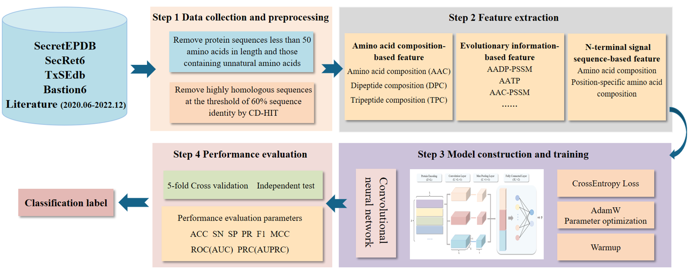

# T6CNN：A genome-scale prediction tool for bacterial type VI secreted effector proteins based on convolutional neural networks

  <div align="center"></div>

## Set up

The standalone version of T6CNN has been tested in Linux.

Before using the T6CNN, please ensure that Python version ≥3.9 has been installed in your server. 
Please check the `requirements.txt` file for more details on required Python packages. You can create new environment and install all required packages with:

```shell
pip install -r requirements.txt

```
## Data Processing

The data processing codes in xxx.py including:
xxx
xxx
xxx

## Using T6CNN

```shell
python T6CNN.py \
   -p={}  \                    # feature_matrix
   -f={}  \                    # protein fasta sequence file to be predicted
   -pr={} \                    # model prefix，such as aac_pssm, eedp, k_separated_bigrams_pssm, pse_pssm, aadp_pssm or bpb100
   -d={}  \                    # Choose any cuda or cpu for prediction. default='cuda:0'
```
After running T6CNN.py, you will get the prediction results in the current directory, the file name is composed of model prefix and '_T6probability.csv' (such as 'aac_pssm_T6probability.csv').

## Testing Result

We have compared T6CNN with existing prediction tools according to the perfomance on an independent test set(28 T6SEs + 185 none-T6SEs). 
|           Method          |  ACC  |  SN   |  SP   |  PR   |  F1   |  MCC  |
| :-----------------------: | :---: | :---: | :---: | :---: | :---: | :---: |
|         Bastion6          | 0.883 | 0.821 | 0.892 | 0.535 | 0.648 | 0.600 |
|         PyPredT6          | 0.718 | 0.500 | 0.751 | 0.233 | 0.318 | 0.189 |
|          T6CNN            | 0.953 | 0.929 | 0.958 | 0.765 | 0.839 | 0.817 |


## Contact

Please contact Yueming Hu at huym@zju.edu.cn for questions.
